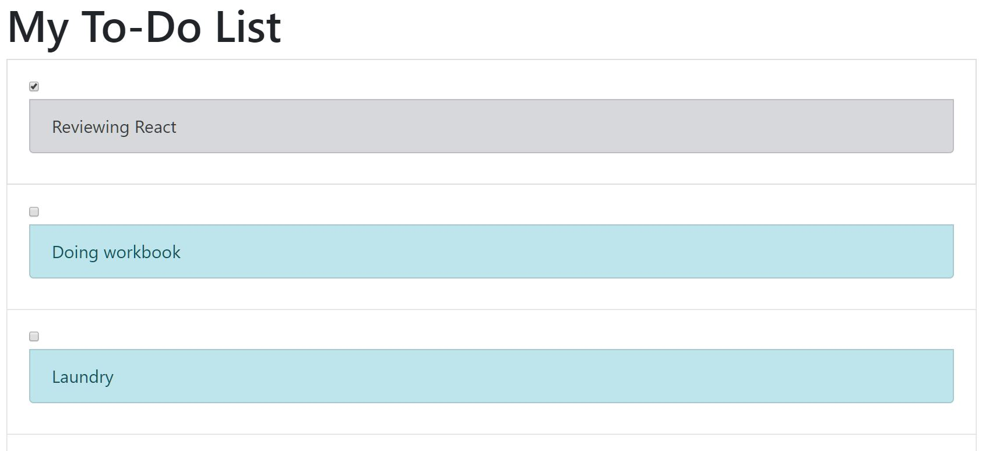

# React - To-do List

A simple React app for to-do list.

---

### Tutorial I followed: [Learn React JS - Full Course for Beginners - Tutorial 2019](https://www.youtube.com/watch?v=DLX62G4lc44&list=WL&index=8&t=12321s)

Ellie's note: I only followed the to-do list challenge, but I think this is a very comprehensive tutorial with lots of hands-on practice. Would recommend this to people who just start learning React.

---

### Dependencies:

#### Bootstrap (4.4.1)

- **NPM**: https://www.npmjs.com/package/bootstrap
- **Documentation**: https://getbootstrap.com/
- The author didn't use Bootstrap in his tutorial. I decided to use Bootstrap & React Bootstrap in this project to practice Bootstrap.

#### React Bootstrap (1.0.0-beta.16)

- **NPM**: https://www.npmjs.com/package/react-bootstrap
- **Documentation**: https://react-bootstrap.github.io/getting-started/introduction
